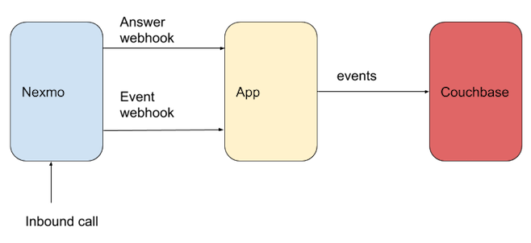

# couchbase-test

Vonage call event logger using Couchbase as the store. This is not a standlone logger, just some code that can be added to a voice app. 

NoSQL is a nice option because Vonage events have a varied structure.

Events can be then readily viewed in the Couchbase WebUI, or using other tools. 

## Overview

The following diagram provides a simple overview of the application:

## Testing

You can test via `ngrok` with Couchbase running locally.

